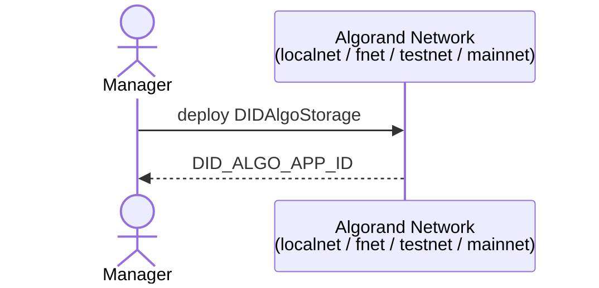
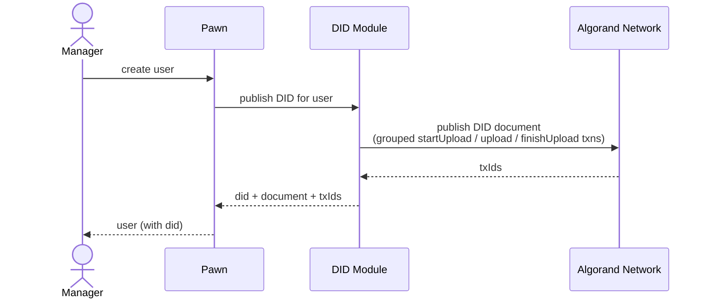
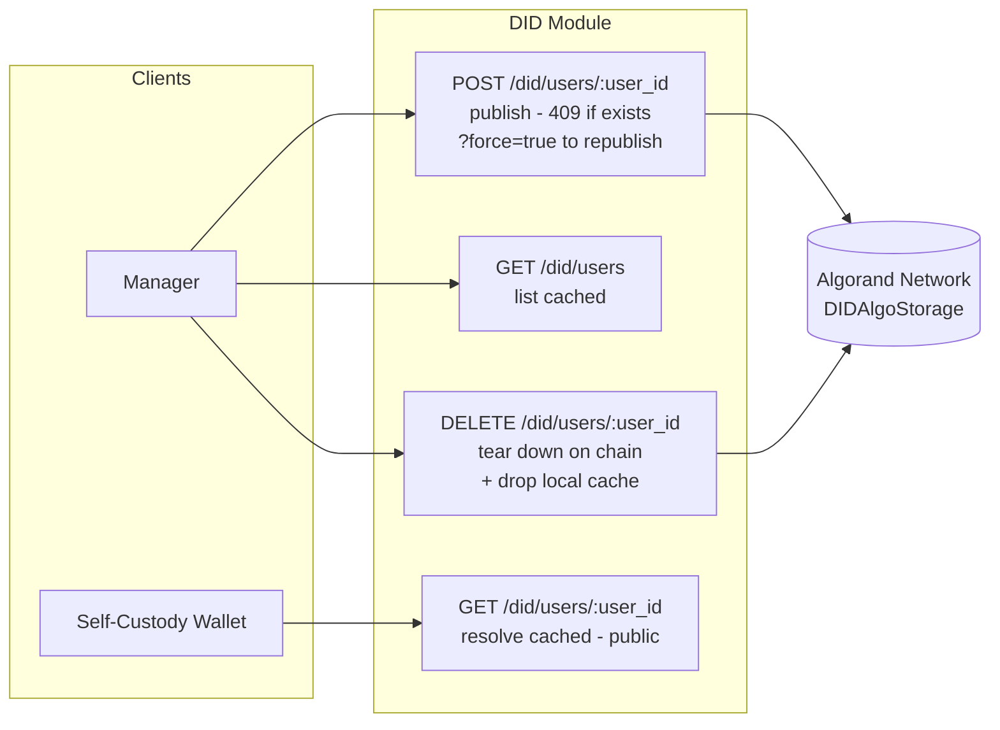
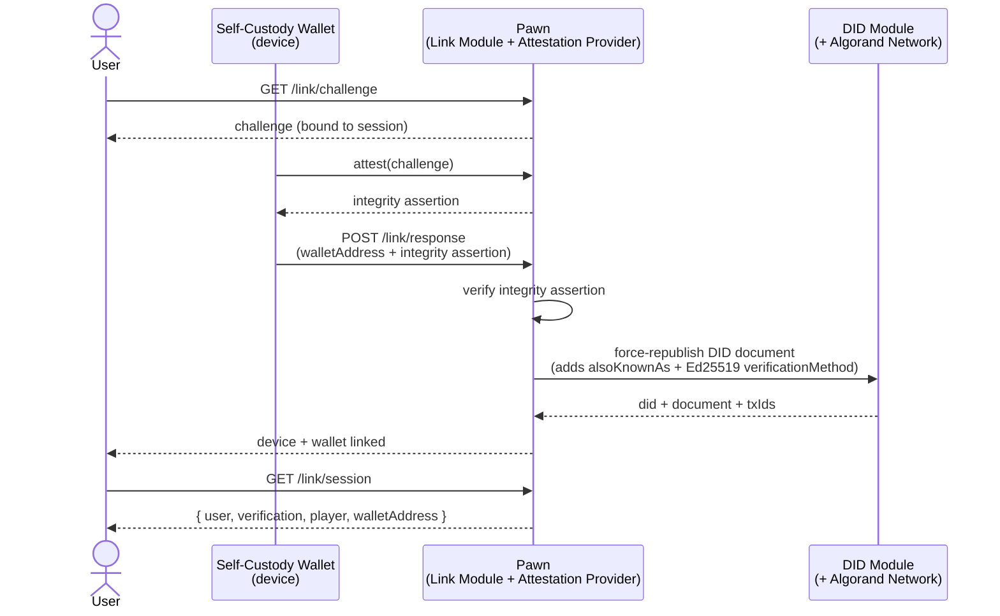

# DID Flows

High-level overview of the `did:algo` flows in this service.

## 1. Deploy `DIDAlgoStorage` to a network

> [!NOTE]
> This is a prerequisite for generating DID documents on user creation.

## 2. Generate DID documents on user creation

> [!NOTE]
> - The manager **automatically publishes a DID document** for every user it creates — the publish step is part of `userCreate`, not a manual call.
> - The fully-qualified `did:algo` identifier is surfaced on the user's response as a plain string under the `did` field (or `null` if no DID has been published).
> - Publication is **fail-fast**: any on-chain failure aborts user creation with a 5xx — there is no `pending` / `failed` cache row. To retry after fixing the underlying issue, call `POST /did/users/:user_id` directly (use `?force=true` to replace an existing on-chain document).

## 3. DID module endpoints

> [!NOTE]
> - These endpoints are **not required for normal operation** — section 2 already covers the auto-publish path.
> - They exist for programmatic management of DID records (e.g. republishing after a key rotation, listing cached records, dropping a stale local cache entry, or resolving a user's document without auth).

## 4. Linking a self-custody wallet

> [!NOTE]
> - Linking attests both the **device** (via app integrity / attestation) and the **account** (via a verified email session) before associating a self-custody wallet with the API user.
> - The wallet's keys never leave the device — the API only stores the public address and the attested device → user → wallet mapping.
> - Once linked, the self-custody wallet is exposed alongside the managed (Vault-custodied) identity through the user response (`wallet_address`).
> - After successful attestation, the user's **DID document is force-republished** to include the linked self-custody wallet as both an `alsoKnownAs` entry (`algorand:<address>`) **and** a second `Ed25519VerificationKey2020` verification method (added to `authentication` and `assertionMethod`). Republish is skipped (with a log) when the user has no on-chain DID yet — the first publish flows through `WalletService.userCreate` instead.

